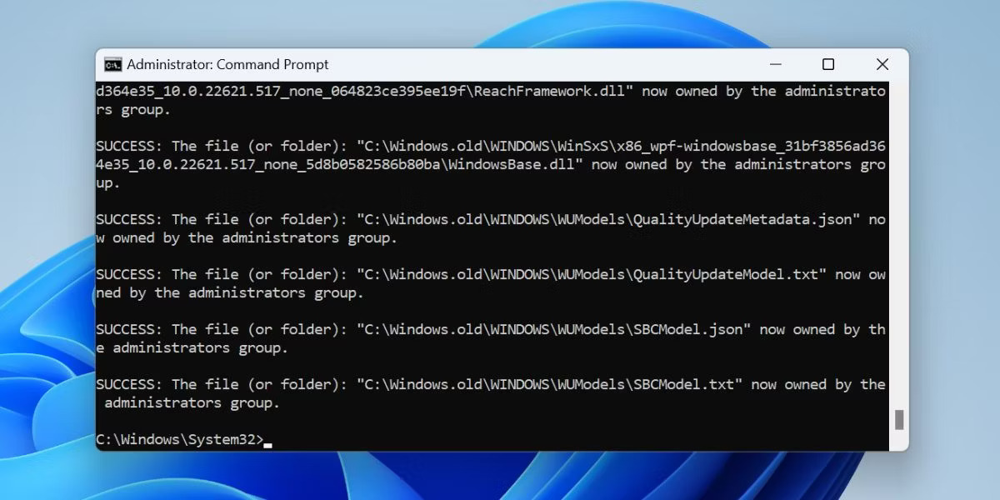
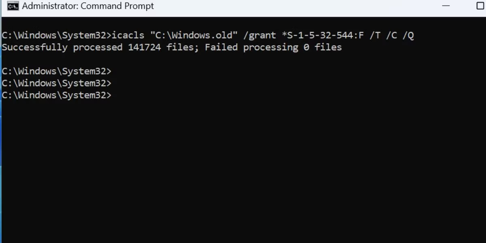
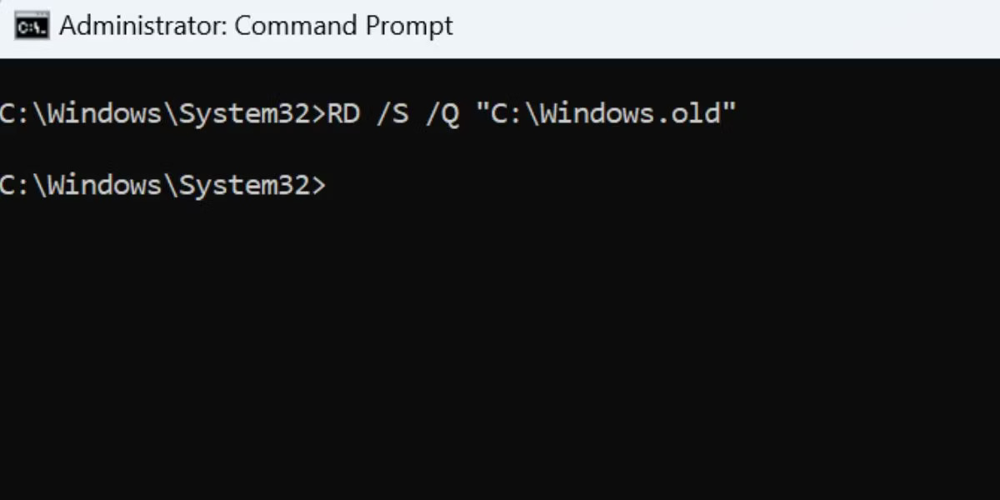

# Apagar a pasta `Windows.old`


### Linha de Comando

Execute o prompt de comandos do MS-DOS como administrador.


Você deve se tornar dono dos arquivos e subdiretórios para pode apaga-los.
Execute o comando abaixo para tornar-se o dono dos arquivos:

```cmd
takeown /F "C:\Windows.old" /A /R /D Y
```


Vocẽ deve conceder permissão ao grupos `*S-1-5-32-544` para poder apagar o conteúdo da pasta `Windows.old`
Execute o comando abaixo para conceder permissões totais ao grupo `*S-1-5-32-544`:

```cmd
icacls "C:\Windows.old" /grant *S-1-5-32-544:F /T /C /Q
```



Agora execute o comando `RD` para apagar a pasta:

```cmd
RD /S /Q "C:\Windows.old"
```


